## О проекте Olympiad API

Проект государственной информационной системы для организации процесса поступления на образовательные программы
бакалавриата с помощью олимпиад, входящих в перечень олимпиад школьников, утвержденный РСОШ.

[](https://mrgeorgeous.github.io/OlympiadAPI/data/site/) &nbsp;
[](https://github.com/gvsem/higholymp) &nbsp;


##### Содержание
* [Вступление](#вступление-ru)
* [Программное решение](#программное-решение)
  * [Инициализация](#инициализация)
  * [Утилиты](#утилиты)
* [Бизнес-процесс](#бизнес-процесс)
  * [Модель данных](#модель-данных)
  * [Функциональные требования](#функциональные-требования)
  * [Развертывание](#развертывание)
* [Благодарности и ссылки](#благодарности-и-ссылки)

##### Что представлено в этом проекте?

- [x] Описание бизнес-процесса с олимпиадами
- [x] Утилита для дата-скрейпинга перечней РСОШ
- [x] Утилита для парсинга pdf-приказа Университета ИТМО
- [ ] Личный кабинет для чиновников и администрации факультетов
- [x] Модель данных и схема базы данных
- [ ] Графический интерфейс для поиска олимпиад и проверки достижений (см. [HighOlymp](https://github.com/gvsem/higholymp))
- [x] Графический интерфейс для подробного просмотра приказов (см. [Demo](https://mrgeorgeous.github.io/OlympiadAPI/data/site/))

### Abstract :uk:

In Russian Federation, admission to the Bachelor's programmes is based on the principle of competition. Prospective students are required to present their General State Exam (рус. Единый Государственный Экзамен) results for the appropriate subject. Alternatively, one can present a school olympiad diploma to bypass standard admission procedure if it comes from a state-approved olympiad. At this point in time there is no governmental service to look up such olympiads, and the most reliable source of information on the matter for prospective students is the websites of individual universities under consideration.

 The present solution features:
* Automatic parsing of RSOSh-designated olympiad decrees;
* Automatic parsing of olympiad decrees designated specifically by ITMO University;
* A data model to store various privileges
* An instance website renderer to explore an expansive list of olympiads

### Вступление :ru:

В Российской Федерации прием на программы бакалавриата осуществляется на конкурсной основе. Будущие студенты должны представить результаты Единого государственного экзамена по соответствующему предмету. В качестве альтернативы можно представить диплом школьной олимпиады из перечня РСОШ, чтобы обойти стандартную процедуру поступления. На данный момент не существует государственного сервиса поиска таких олимпиад и соответствующих льгот, и наиболее надежным источником информации по этому вопросу для будущих студентов являются сайты отдельных рассматриваемых университетов.

Программное решение представляет:

* Автоматический парсинг постановлений олимпиад, назначенных РСОШ;
* Автоматический парсинг приказов об особых льготах, определенных Университетом ИТМО;
* Модель данных для хранения различных привилегий
* Рендерер сайта с исчерпывающим списком олимпиад и льгот по годам

Например, так выглядят текущие документы, содержащие информацию для определения льгот на программы бакалавриата:

[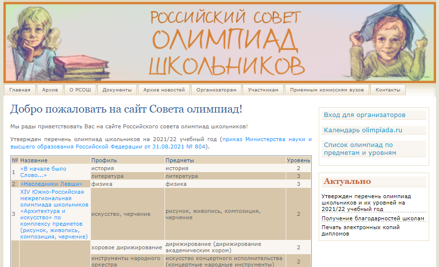](./uml/rsosh.png)
[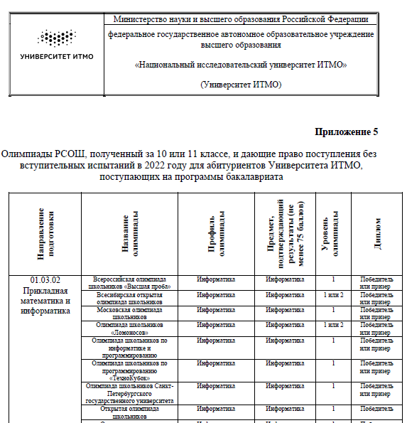](./uml/list.png)

Примеры приказов, для которых был построен сайт, можно найти в папке [`/resources`](https://github.com/gvsem/OlympiadAPI/tree/master/resources)

### Программное решение

#### Инициализация

Для инициализации и сериализации данных был разработан набор утилит, полуавтоматически собирающих информацию из общедоступных документов.
* `__main__`: скачивает перечни олимпиад за последние четыре года с сайта РСОШ и перечень специальностей высшего образования ОКСО для бакалавриата и специалитета
  * `data/schedules` — json-файлы с перечнями олимпиад
  * `data/profiles.json` — список всех профилей
  * `data/subjects.json` — список всех предметов
  * `data/specialities.json` — список специальностей в соответствии с ОКСО третьего поколения
* `init_itmo`: принимает pdf-файлы приказов Университета ИТМО, содержащие таблицы льгот “БВИ” и “100 баллов” для образовательных программ
  * data/privileges/itmo.json — льготы Университета ИТМО
* `init_db`: инициализирует базу данных данными, полученными на предыдущих шагах
* `init_site`: генерирует простой сайт, содержащий структуру импортированных университетов и льготы по программам
  
[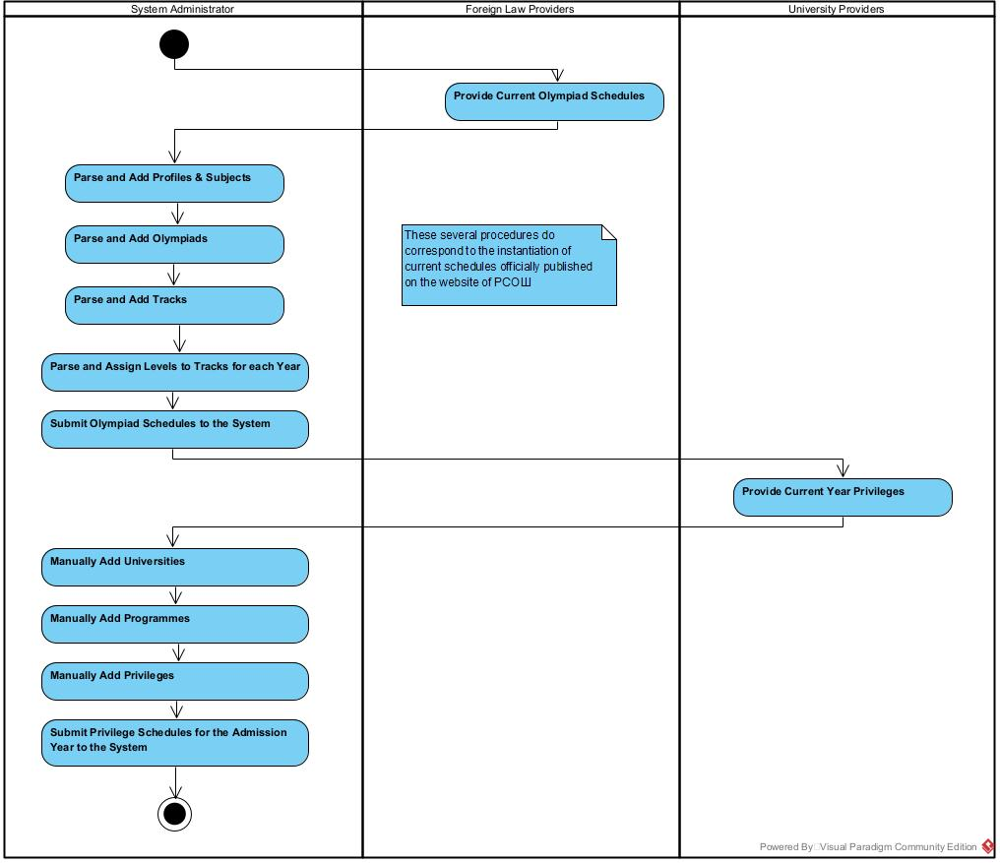](./uml/activity1.png)

#### Утилиты

Продемонстрируем процесс использования утилиты `__main__`:

```bash
*** Olympiad API Initialization Toolkit ***
Вас приветствует мастер инициализации данных для Olympiad API.
Инициализация состоит из следующих шагов:
 > 1: Определить профили и предметы олимпиад
 > 2: Добавить олимпиады из перечней за четыре года
===== Подготовка данных =====
Скачать перечни РСОШ в data/schedules/? [Y]
Укажите текущий год приема [2022]
Скачиваем год 2022...
Скачиваем год 2021...
Скачиваем год 2020...
Скачиваем год 2019...
Извлечь профили и предметы из перечней в data/schedules/? [Y]
Найти похожие олимпиады и опечатки в перечнях РСОШ? [Y]
     Совпадения: data/schedules\2021.json vs. data/schedules\2020.json
     >>> XIII Южно-Российская межрегиональная олимпиада школьников «Архитектура и искусство» по комплексу предметов (рисунок, живопись, композиция, черчение) ||| XIV Южно-Российская межрегиональная олимпиада школьников «Архитектура и искусство» по комплексу предметов (рисунок, живопись, композиция, черчение)
     >>> Заменить на XIV Южно-Российская межрегиональная олимпиада школьников «Архитектура и искусство» по комплексу предметов (рисунок, живопись, композиция, черчение) [y, n, yall, nall] ? [n]yall
     >>> Межрегиональная открытая олимпиада по музыкально-теоретическим дисциплинам для учащихся детских музыкальных школ и детских школ искусств ||| Всероссийская олимпиада по музыкально-теоретическим дисциплинам для учащихся детских музыкальных школ и детских школ искусств
     Совпадения: data/schedules\2020.json vs. data/schedules\2019.json
     >>> XII Южно-Российская межрегиональная олимпиада школьников «Архитектура и искусство» по комплексу предметов (рисунок, живопись, композиция, черчение) ||| XIV Южно-Российская межрегиональная олимпиада школьников «Архитектура и искусство» по комплексу предметов (рисунок, живопись, композиция, черчение)
     >>> Межрегиональная олимпиада школьников им. В.Е. Татлина ||| Межрегиональная олимпиада школьников им. В.Е.Татлина
     >>> Наследники Левши ||| «Наследники Левши»
     >>> Сибирская межрегиональная олимпиада школьников «Архитектурное дизайнерское творчество» ||| Сибирская межрегиональная олимпиада школьников «Архитектурно-дизайнерское творчество»
Найти похожие профили/предметы в опечатках РСОШ? [Y]
    >>> Похожие профили:  [('академический рисунок, живопись, композиция, история искусств и культуры', 'академический рисунок, живопись, композиция, история искусства и культуры'), ('академический рисунок, живопись, композиция, история искусства и культуры', 'академический рисунок, живопись, композиция, история искусств и культуры'), ('астрономия и науки о Земле', 'астрономия и науки о земле'), ('астрономия и науки о земле', 'астрономия и науки о Земле'), ('иностранные языки', 'иностранный язык'), ('иностранный язык', 'иностранные языки'), ('передовые и производственные технологии', 'передовые производственные технологии'), ('передовые производственные технологии', 'передовые и производственные технологии')]
    >>> Похожие предметы:  [('иностранные языки', 'иностранный язык'), ('иностранный язык', 'иностранные языки'), ('искусство концертного исполнительства (концертные народные инструменты)', 'искусство концертного исполнительства (концертные струнные инструменты)'), ('искусство концертного исполнительства (концертные струнные инструменты)', 'искусство концертного исполнительства (концертные народные инструменты)'), ('оптичесике и биотехнические системы и технологии', 'оптические и биотехнические системы и технологии'), ('оптические и биотехнические системы и технологии', 'оптичесике и биотехнические системы и технологии'), ('технологии легкой промышленности', 'технологии легкой промышлености'), ('технологии легкой промышлености', 'технологии легкой промышленности'), ('техносферная безопасность и природообустройство', 'техносферная безопасность и природоустройство'), ('техносферная безопасность и природоустройство', 'техносферная безопасность и природообустройство'), ('филология (профиль «отечественная филология»)', 'филология профиль "отечественная филология"'), ('филология профиль "отечественная филология"', 'филология (профиль «отечественная филология»)'), ('фундаментальная математика и механика', 'фундаментальные математика и механика'), ('фундаментальные математика и механика', 'фундаментальная математика и механика'), ('экология и природоиспользование', 'экология и природопользование'), ('экология и природопользование', 'экология и природоиспользование'), ('электро - и теплоэнергетика', 'электро- и теплоэнергетика'), ('электро- и теплоэнергетика', 'электро - и теплоэнергетика'), ('электроника', 'элетроника'), ('элетроника', 'электроника')]
    >>> Принять эти правки (левые)? [Y]
===== Подготовка к запуску вашего университета =====
Скачать перечень специальностей ОКСО 3? [Y]
===== Проверка данных =====
 $$$$ Проверим данные $$$$ 
Всего профилей и предметов:  111 180
Похожих профилей и предметов:  8 20
Всего специальностей:  289
Перечени олимпиад РСОШ: 
  >>>  data/schedules\2019.json  содержит  80  олимпиад с  257 направлениями
  >>>  data/schedules\2020.json  содержит  83  олимпиад с  283 направлениями
  >>>  data/schedules\2021.json  содержит  86  олимпиад с  299 направлениями
  >>>  data/schedules\2022.json  содержит  86  олимпиад с  299 направлениями
```

Вы можете посмотреть полученные данные в папке [`/data`](./data)

Продемонстрируем процесс использования утилиты `init_itmo`:

```bash
*** Мастер инициализации особых прав Университета ИТМО ***
Это специальная утилита для автоматической загрузки данных из приказов.
Пути к файлам можно задать в скрипте.
приказ о 100 баллах:  resources/100ballov_2022.pdf
приказ о бви:  resources/rsosh_2022_bvi.pdf
Нажмите enter, чтобы начать с нуля [Y]
Читаем pdf о 100 баллах...
Читаем pdf о БВИ...
Дело за малым: обновим информацию о специальностях
```
Продемонстрируем процесс использования утилиты `init_db`:
```bash
Заполнить перечнями РСОШ? [Y]
4
x
x
x
x
Заполнить информацией для Университета ИТМО? [Y]
>>>>>>  Компьютерные технологии: Программирование и искусственный интеллект
Не получилось импортировать такую льготу: Вузовско-академическая олимпиада по информатике информатика
Откатываемся...
Не получилось импортировать такую льготу: Олимпиада Национальной технологической инициативы большие данные и машинное обучение
Откатываемся...
>>>>>>  Разработка программного обеспечения / Software Engineering
>>>>>>  Компьютерные системы и технологии
>>>>>>  Мобильные и сетевые технологии
>>>>>>  Системное и прикладное программное обеспечение
>>>>>>  Технологии защиты информации
>>>>>>  Программирование в инфокоммуникационных системах
>>>>>>  Цифровые технологии в индустрии
>>>>>>  Цифровые системы управления
>>>>>>  Робототехника и искусственный интеллект
>>>>>>  Прикладная оптика
>>>>>>  Лазерные технологии
>>>>>>  Энергоэффективность и возобновляемая энергетика
>>>>>>  Инжиниринг энергетических систем
>>>>>>  Экотехнологии и устойчивое развитие
>>>>>>  Биоинженерия
>>>>>>  Инфохимия
>>>>>>  Биотехнология
>>>>>>  Физика наноструктур
>>>>>>  Управление технологическими инновациями
>>>>>>  Бизнес-информатика
>>>>>>  Компьютерные технологии в дизайне
>>>>>>  Иностранные языки и информационные технологии / Humanities and IT
>>>>>>  Фотоника и оптоинформатика
```

### Бизнес-процесс

Ежегодно РСОШ утверждает перечень олимпиад, учитывающийся при поступлении на программы бакалавриата в университетах России. Организаторы регистрируют свои олимпиады, а также их направления.

[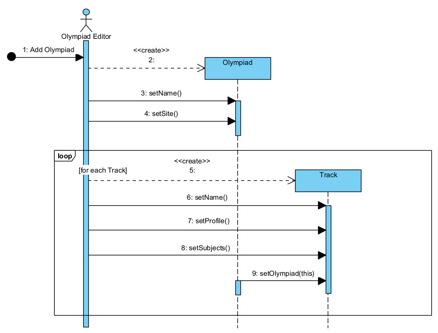](./uml/sequence2.png)

Администраторы перечня РСОШ назначают соответствующие уровни на направления олимпиад.

[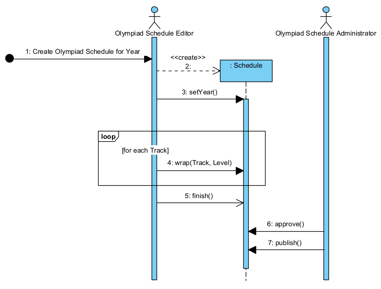](./uml/sequence3.png)

Перечень проходит процедуру утверждения и публикации.

[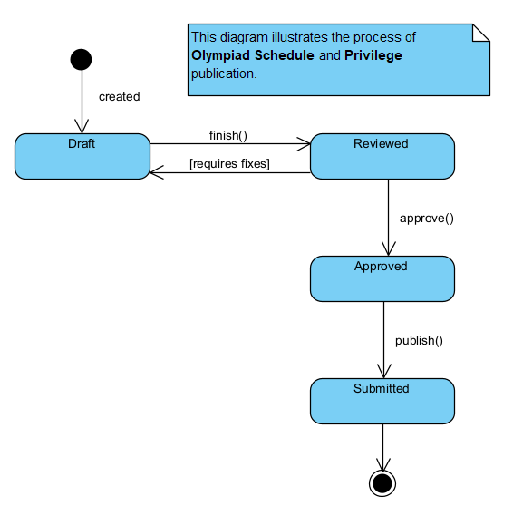](./uml/state.png)

#### Модель данных

Основными сущностями информационной модели являются Olympiad, Schedule и Track.

[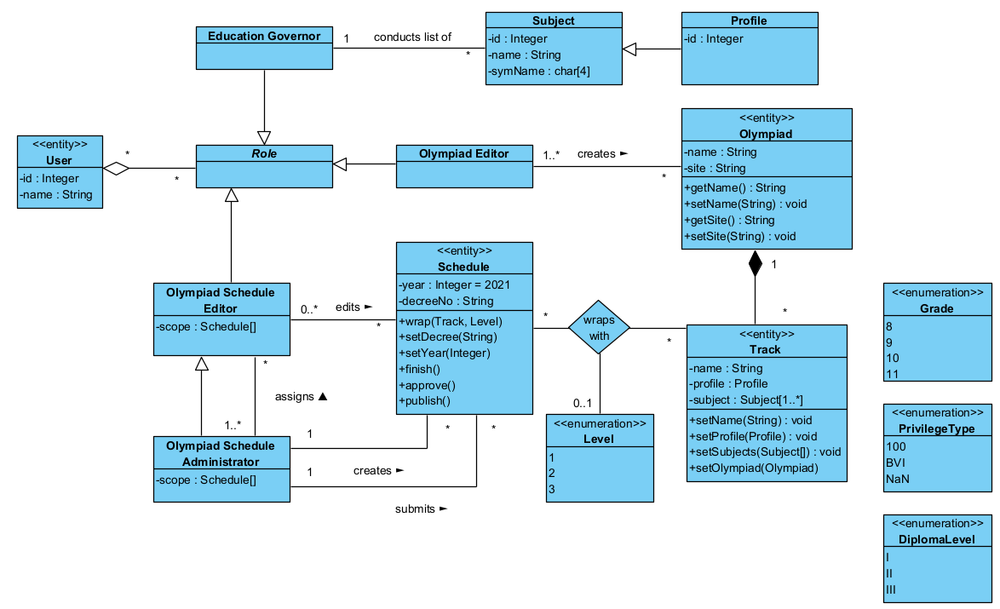](./uml/class1.png)

Для представления льгот, предоставляемых на образовательные программы, используются сущности University, Faculty, Programme и Privilege.

[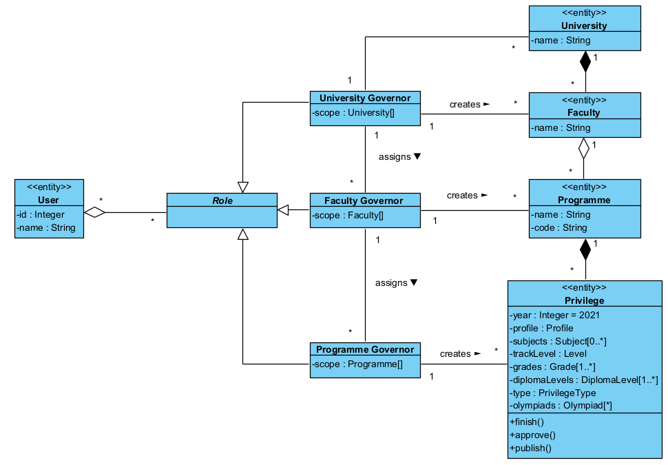](./uml/class2.png)

Программно модель представляется как набор реляционных таблиц:
1 — олимпиады и направления, 2 — перечни олимпиад и их уровни, 3 — структура университета, 4 — льготы, 5 — представления, состоящие из таблиц выше, 6 — пользователи и роли (не реализованы)

[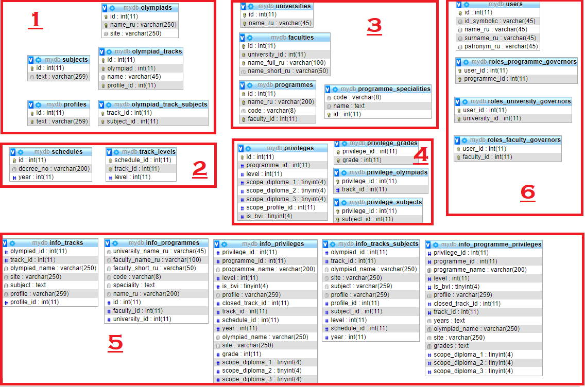](./uml/db.png)

#### Функциональные требования

Функциональные требования:
* Руководителям образовательных программ, приемным комиссиям университета
  * автоматизированная генерация приложений к Правилам приема ("Перечень олимпиад школьников, проводимых в соответствии с
Порядком проведения олимпиад школьников, по результатам которых предоставляются особые права....")
* Абитуриентам и их родителям
  * поиск особых прав для поступления на программы бакалавриата в зависимости от имеющихся достижений
  * просмотр и поиск по каталогу образовательных программ для поступления

Система предоставляет доступ к составлению и утверждению перечней РСОШ для государственных органов.

[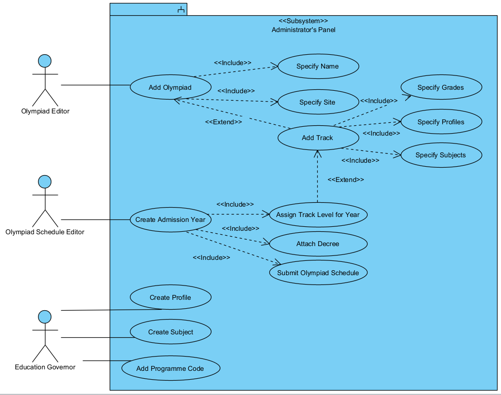](./uml/usecase1.png)

Если данные инициализируются из существующих перечней, используется сценарий с парсингом данных с сайта РСОШ. Если перечень составляется с нуля, то используется сценарий c ручным добавлением олимпиад и утверждением перечня.

[](./uml/activity1.png)
[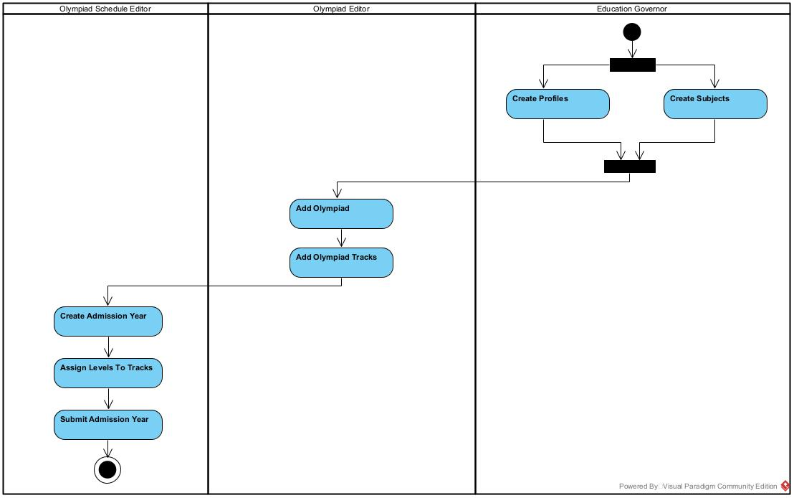](./uml/activity2.png)

Администрации университетов и факультетов могут спроектировать свои перечни олимпиад, на основании которых предоставляются льготы при поступлении.

[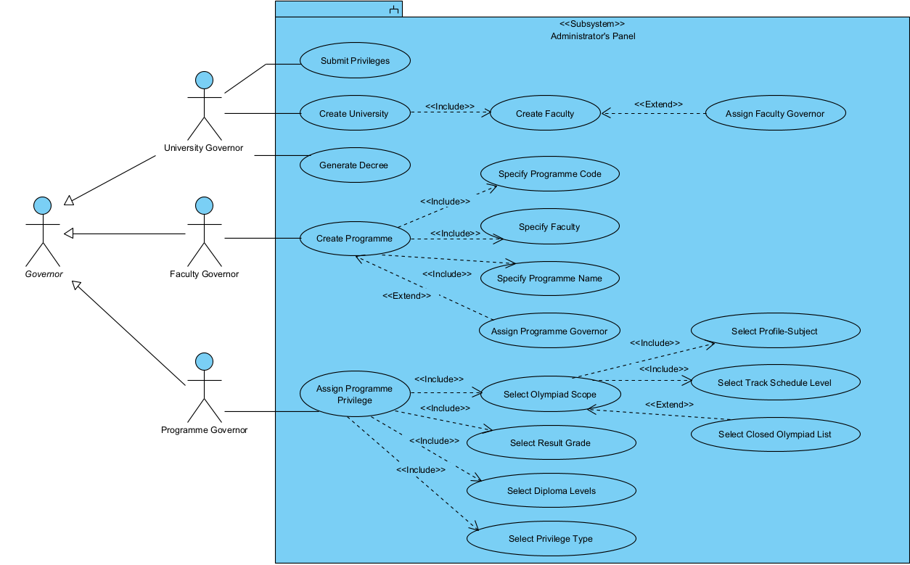](./uml/usecase3.png)

[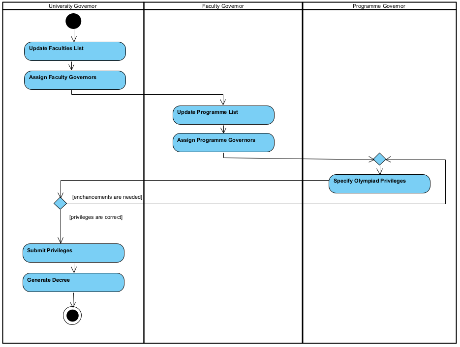](./uml/activity3.png)

Абитуриенты также могут познакомиться со списком программ, перечнем льгот, а также проверить, какие льготы предоставляют их текущие достижения.

[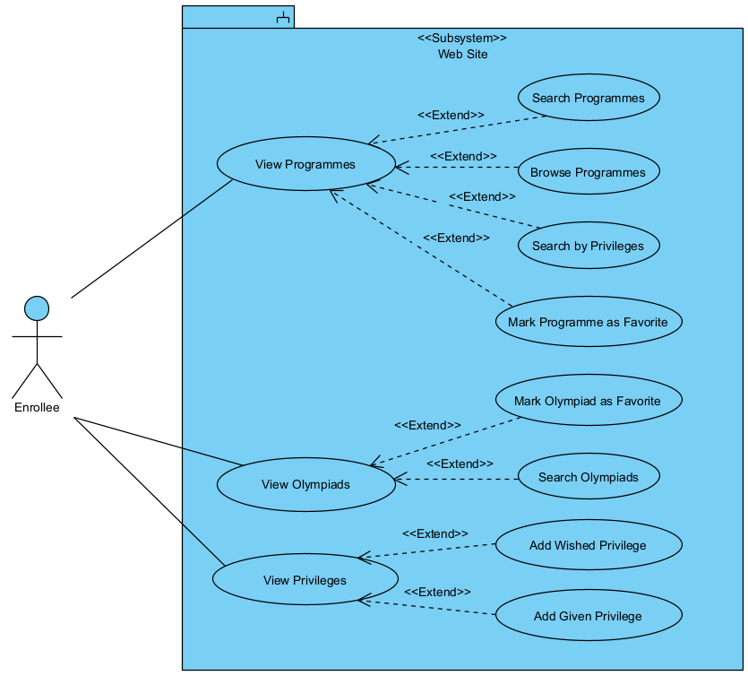](./uml/usecase2.png)

#### Развертывание

Система предполагает реализацию в виде набора REST-микросервисов на основе структур данных json.

[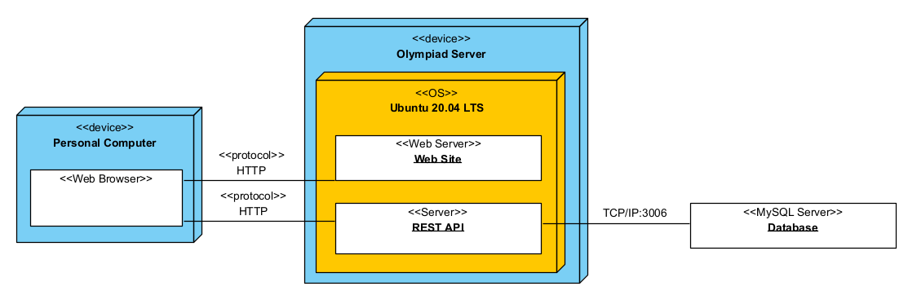](./uml/deployment.png)

### Благодарности и ссылки

Этот проект был выполнен в рамках курса М.В. Хлопотова по проектированию на UML

Olympiad API является продолжением проекта, выполненного мной в 10 классе, — [HighOlymp](https://github.com/gvsem/higholymp)


